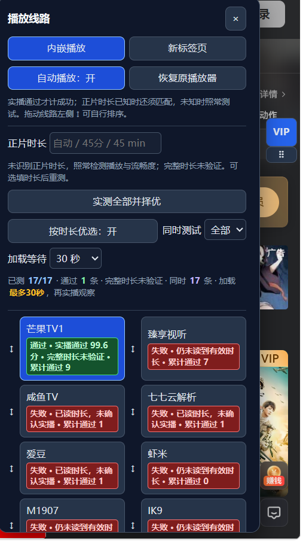

# vip视频解析线路优选助手

维护者：**yk1234f**。版本：**3.2.0**。

配合篡改猴使用：https://www.tampermonkey.net/
安装文件：`vip视频解析线路优选助手.user.js`。这是采用独立名称和 namespace 的修改版，来源与许可证情况见 `SOURCE_NOTICES.md`，改名不能消除上游授权义务。
https://greasyfork.org/zh-CN/scripts/596803-vip%E8%A7%86%E9%A2%91%E8%A7%A3%E6%9E%90%E7%BA%BF%E8%B7%AF%E4%BC%98%E9%80%89%E5%8A%A9%E6%89%8B

## 界面示例

测试进行中会显示并发进度、加载等待时间和不同颜色的线路状态：


测试结束后会保留本轮详细结果，并在末尾显示本地累计通过次数：




## 安装使用

1. 篡改猴中新建脚本，粘贴安装文件的全部代码并保存。
2. 停用旧的“爱观影视vip通行证”等版本，刷新视频页，避免多个脚本同时操作播放器。
3. 点击悬浮按钮，检查“正片时长”。B 站 BV 视频通过官方信息接口读取当前分 P 的时长；其他站点尝试读取结构化时长。
4. 点击“实测全部并择优”。默认同时检测全部 **未隐藏的 17 条独立服务入口**。加载等待可选 30、60、90、120 秒，默认 30 秒；读到匹配时长后，再给最多 45 秒实播观察窗口。也可每批检测 1、3、6 条，降低带宽和内存占用。
5. 等待本轮结束后，从通过时长与实播检测的线路中选出评分最高的一条，关闭其余播放器。通过的候选先暂停等待最终比较。
6. 打开“自动播放”和“按时长优选”后，访问同站视频页会自动启动选线。“自动播放”默认关闭，避免安装后立即在所有视频页启动全量检测。

为检测跨域视频，脚本会在列出的解析站点和匹配 iframe 中运行，不再使用 `@noframes`。为覆盖解析服务动态跳转到的未知嵌套域名，3.2 保留 HTTP/HTTPS 子页面匹配权限。无关顶层页面不显示菜单；子帧只接受受支持顶层页面发出的、绑定窗口和随机会话标识的检测命令。额外连接的官方接口仍只有 `api.bilibili.com`，不使用 `@connect *` 或远程 JavaScript。安装或更新时会出现更广的页面访问权限提示。

## 时长及流畅度

- 时长容差为正片的 2%，最少 3 秒、最多 90 秒。示例 `BV133ew6VEAV` 官方接口返回第 1 P 为 **978 秒（16:18）**，容差约 20 秒，五六分钟的线路不符合。
- 不使用原生 video 的试看/广告时长作为正片标准。读不到可信时长时，需要填写一次；纯数字表示分钟，也可填 `16:18`、`16分18秒`、`16 min 18 sec`、`Duration: 16:18`、`一小时三十分钟`。
- 候选至少观察 8 秒，有至少 4 秒播放推进、有可播放数据、无已报告媒体错误。进度条跳播不算连续播放。
- 评分依据推进比例、卡顿次数、起播等待、缓冲和丢帧比例。通过后先暂停，测完所有候选再选本轮最高分。
- 线路卡片第一段显示本轮状态和详细过程，末尾显示本地累计通过次数；通过、失败、测试中和未测试分别使用绿色、红色、橙黄色和灰色状态块区分。
- 不再在 8 秒时判定短片失败：0:00、临时短片、广告先继续等待。加载窗口到期仍不符才标为未通过。
- 失败、未知、超时不代表永久失效，不会自动删除线路。检测结果显示在列表及线路悬浮提示中。

短时实播和时长匹配不能保证整部视频每一秒都能播放，也不能证明内容一致。评分反映本轮测试；全量并发分摊带宽，可能影响结果。原网页音视频在内嵌期间持续暂停、静音，恢复播放器时解除监听并还原设置。

## 成功次数与排序

- 每条线路每轮通过检测后增加 1 次成功数，不仅最终胜者计数。
- 单纯点击、新标签页打开或 iframe 加载完毕不计成功。
- v2 的打开次数不会冒充成功次数；新计数单独保存。新 namespace 的存储通常也与旧脚本分离。
- 拖动线路左侧 **↕** 调整顺序，刷新后保留；聚焦按钮后按上下方向键也可移动。检测中暂时禁用拖拽，避免列表更新打断操作。
- “按成功次数排序”清除自定义顺序，按成功次数、最近成功时间排列。
- 自定义顺序影响列表及分批测试队列，最终选择仍看评分。同一视频上次成功的线路可优先进入分批测试，但会重新检测。

## 边界

拒绝 iframe、验证码、无法注入检测脚本的沙箱页面、站点额外限制或自动播放限制可能导致无法检测，显示未知/超时，不编造成功。测试会访问各第三方线路并发送当前视频网址；B 站链接剔除跟踪参数，仅保留 BV 和分 P 信息。

暂停及 preload=none 不保证停止原站所有 fetch/XHR/MSE 下载。原播放器内的旧 iframe 临时卸载，恢复时重新加载，原进度不保证保留。

## 验证

2026-09-21：Node.js 语法检查通过；jsdom 主回归 **26 项**、检测报告器及纯函数 **5 项**通过。覆盖全量并发、未知时长回退、全轮择优、计数、试看排除、取消清理、分 P、消息校验、排序、播放推进、缓冲、丢帧和静音恢复。实际请求 B 站官方接口成功，示例第 1 P 时长为 978 秒。

3.2 另在真实 Edge 的隔离本地夹具中验证了封闭 Shadow DOM 原视频暂停/静音/音量归零、重复 play 拦截、未知跨域嵌套播放器、未知正片时长回退、实播择优及只保留胜者，均通过。夹具使用真实 HTMLMediaElement 播放合成 WAV，不是仅伪造消息。

**未完成真实篡改猴安装和腾讯站上真实 17 路播放验证。** 模拟测试不证明第三方线路实际都能工作。Greasy Fork 规则页多次访问失败，未完成最新站规逐条核验，也未发布到 Greasy Fork。

## 构建和测试

```powershell
npm install --cache .\.npm-cache --no-audit --no-fund
python .\build.py
Get-Content -LiteralPath '.\vip视频解析线路优选助手.user.js' -Raw | node --check
Get-Content -LiteralPath '.\test.cjs' -Raw | node --preserve-symlinks
Get-Content -LiteralPath '.\reporter-test.cjs' -Raw | node --preserve-symlinks
```

主体、时长工具、子页面报告器及并发选择器分模块维护，构建后只需安装一个 `.user.js`。jsdom 只用于本地测试。

## 腾讯参考页

以用户提供的 `s4102dlk9wg` 页面为参考，实际抓取当前页面和前端公开脚本，确认当前站使用 Vue/Pinia 的 `union.videoInfoMap[vid]` 保存时长，3.2 保留按当前 VID 读取此数据的路径，最多等待20秒。试看片段的原生 video.duration 不作为正片依据。匿名直连站点元数据接口返回业务错误，尚未从真实页面成功核验该集的正片时长；读不到时照常进行实播择优，并保留中英文手动输入。

安装仍然只需要一个 `.user.js`；开发目录和旧源码包不需要导入篡改猴。

